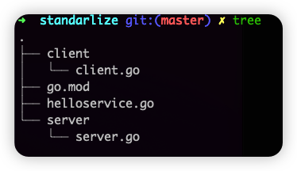

# Go-rpc

---

# 1. 基于 `net/rpc` 的 Hello world

## 1.1 定义要暴露的服务端服务

<aside>
🍀 Go RPC规则：待暴露服务方法只能有两个可序列化的参数，其中第二个参数是指针类型，并且返回一个error类型，同时必须是公开的方法。

</aside>

```go
type HelloService struct {}

func (p *HelloService) Hello(request string, reply *string) error {
    *reply = "hello:" + request
    return nil
}
```

## 1.2 注册并提供服务

<aside>
🍀 通过 `rpc.Register` 函数调用将对象类型中满足 `RPC` 规则的对象方法注册为 `RPC` 函数

</aside>

```go
func main() {
    rpc.RegisterName("HelloService", new(HelloService))

    listener, err := net.Listen("tcp", ":1234")
    if err != nil {
        log.Fatal("ListenTCP error:", err)
    }

    conn, err := listener.Accept()
    if err != nil {
        log.Fatal("Accept error:", err)
    }

    rpc.ServeConn(conn)
}
```

## 1.3 创建客户端调用 RPC 服务

<aside>
🍀 通过 `rpc.Dial` 拨号 `RPC` 服务，返回一个 `rpc.Client` 客户端，并使用其 `Call` 方法进行 `RPC` 服务调用，参数分别为 `RPC` 服务名.方法名以及 `RPC` 方法的参数。

</aside>

```go
func main() {
    client, err := rpc.Dial("tcp", "localhost:1234")
    if err != nil {
        log.Fatal("dialing:", err)
    }

    var reply string
    err = client.Call("HelloService.Hello", "world", &reply)
    if err != nil {
        log.Fatal(err)
    }

    fmt.Println(reply)
}
```

---

# 2. 重构 HelloService 服务

## 2.1 目录结构



## 2.2 公共接口

<aside>
🍀 公共接口 `HelloService` 分为三个部分：
1. 服务的名字；
2. 服务要实现的详细方法列表；
3. 注册该服务的函数；

</aside>

```go
package standarlize

import "net/rpc"

const HelloServiceName = "standarlize.HelloService"

type HelloServiceInterface interface {
	Hello(request string, reply *string) error
}

func RegisterHelloService(svc HelloServiceInterface) error {
	return rpc.RegisterName(HelloServiceName, svc)
}
```

## 2.3 服务提供方

<aside>
🍀 服务提供方基于公共服务接口，实现自己的一套服务逻辑，并暴露出来以供调用:
1. 实现服务接口；
2. 注册服务；
3. 监听端口；
4. 获得链接；
5. 对链接进行处理；

</aside>

```go
package main

import (
	"log"
	"net"
	"net/rpc"
	"standarlize"
)

type HelloService struct{}

func (h *HelloService) Hello(request string, reply *string) error {
	*reply = "Hello " + request
	return nil
}

func main() {
	helloService := HelloService{}
	err := standarlize.RegisterHelloService(&helloService)
	if err != nil {
		log.Fatal("Register error: ", err)
	}

	lis, err := net.Listen("tcp", ":8080")
	if err != nil {
		log.Fatal("Listen TCP error: ", err)
	}

	conn, err := lis.Accept()
	if err != nil {
		log.Fatal("Accept error: ", err)
	}

	rpc.ServeConn(conn)

}
```

## 2.4 服务引用方

<aside>
🍀 1. 拨号获得客户端；
2. 发起服务调用获得结果；

</aside>

```go
package main

import (
	"fmt"
	"log"
	"net/rpc"
	"standarlize"
)

func main() {
	client, err := rpc.Dial("tcp", "localhost:8080")
	if err != nil {
		log.Fatal("dailing: ", err)
	}

	var reply string
	err = client.Call(standarlize.HelloServiceName+".Hello", "world", &reply)
	if err != nil {
		log.Fatal(err)
	}
	fmt.Println(reply)
}
```

## 2.5 重构 公共服务接口

<aside>
🍀 添加客户端的服务调用封装，方便客户端调用

</aside>

```go
type HelloServiceClient struct {
	*rpc.Client
}

func DialHelloService(network, address string) (*HelloServiceClient, error) {
	c, err := rpc.Dial(network, address)
	if err != nil {
		return nil, err
	}
	return &HelloServiceClient{Client: c}, nil
}

func (hc *HelloServiceClient) Hello(request string, reply *string) error {
	return hc.Client.Call(HelloServiceName+".Hello", request, reply)
}
```

## 2.6 简化客户端服务调用

```go
    client, err := standarlize.DialHelloService("tcp", "localhost:8080")
	if err != nil {
		log.Fatal(err)
	}
	var reply string
	err = client.Hello("world", &reply)
	if err != nil {
		log.Fatal(err)
	}
	fmt.Println(reply)
```

## 2.7 服务端开启协程
```go
    helloService := HelloService{}
	err := standarlize.RegisterHelloService(&helloService)
	if err != nil {
		log.Fatal("Register error: ", err)
	}

	lis, err := net.Listen("tcp", ":8080")
	if err != nil {
		log.Fatal("Listen TCP error: ", err)
	}

	for {
		conn, err := lis.Accept()
		if err != nil {
			log.Fatal("Accept error: ", err)
		}

		go rpc.ServeConn(conn)
	}
```